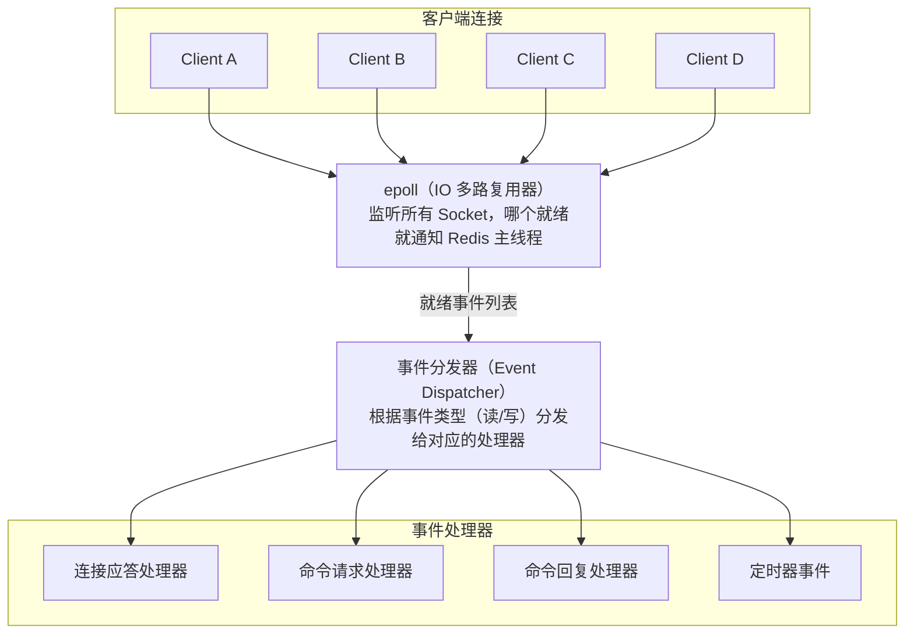

# Redis 技术深度精讲

> 定位：由浅入深的知识体系，学完真正理解底层原理。

---

## 一、Redis 为什么这么快？

### 1.1 直觉类比

把 MySQL 想象成一个**图书馆**：你要找一本书，先查索引卡片（B+Tree 索引），然后走到书架前（磁盘寻道），再把书取出来（磁盘读取）。整个过程至少要几毫秒。

Redis 就像你的**书桌**：常用的书直接摊在桌上（内存），伸手就拿到了。速度差距就是「走到书架 vs 伸手拿」的差距。

### 1.2 快的三大原因

<div align="center"><b>Redis 高性能的三大支柱</b></div>

<table align="center" style="border-collapse: separate; border-spacing: 20px 0; margin-top: 8px;">
  <tr>
    <td style="border: 2px solid #555; padding: 14px 22px; vertical-align: top; width: 170px; line-height: 1.6;">
      <div align="center" style="font-weight: bold; margin-bottom: 10px;">纯内存操作</div>
      内存访问：<br>~100ns<br>
      磁盘访问：<br>~10ms<br><br>
      差距：10万倍
    </td>
    <td style="border: 2px solid #555; padding: 14px 22px; vertical-align: top; width: 170px; line-height: 1.6;">
      <div align="center" style="font-weight: bold; margin-bottom: 10px;">单线程模型</div>
      无锁竞争<br>
      无上下文切换<br>
      无死锁风险<br>
      代码简单高效
    </td>
    <td style="border: 2px solid #555; padding: 14px 22px; vertical-align: top; width: 170px; line-height: 1.6;">
      <div align="center" style="font-weight: bold; margin-bottom: 10px;">IO 多路复用</div>
      一个线程同时<br>
      监听数千连接<br>
      epoll 驱动<br>
      非阻塞 IO
    </td>
  </tr>
</table>

**1. 纯内存操作**
- 内存随机访问延迟约 100 纳秒，磁盘随机访问约 10 毫秒
- Redis 所有数据结构都在内存中操作，这是快的根本原因

**2. 单线程命令执行**
- Redis 用单线程执行所有命令，避免了多线程的锁竞争和上下文切换
- 单个命令执行时间通常在微秒级，单线程足以支撑 10 万+ QPS
- 瓶颈不在 CPU，而在内存和网络

**3. IO 多路复用（epoll）**
- 一个线程同时监听成千上万个 Socket 连接
- 哪个连接有数据到达，就处理哪个，不会傻等

> **一句话总结：** 内存提供了速度基础，单线程消除了锁开销，IO 多路复用解决了并发连接问题。

---

## 二、IO 多路复用模型详解

### 2.1 为什么需要 IO 多路复用？

假设 Redis 用传统的「一个连接一个线程」模型：
- 1000 个客户端连接 = 1000 个线程
- 大部分时间这些线程都在等待数据（阻塞在 read 上），白白占用内存和 CPU

IO 多路复用的思路是：**用一个线程监控所有连接，谁有数据就处理谁。**

### 2.2 工作流程



处理流程：
1. 所有客户端连接注册到 epoll
2. epoll 阻塞等待，直到有连接就绪（有数据可读或可写）
3. epoll 返回就绪连接列表
4. Redis 主线程**依次**处理这些就绪事件（读取命令 → 执行 → 返回结果）
5. 回到第 2 步继续等待

### 2.3 select / poll / epoll 对比

| 特性 | select | poll | epoll |
|---|---|---|---|
| 最大连接数 | 1024（受 FD_SETSIZE 限制） | 无限制 | 无限制 |
| 实现方式 | 每次调用都要把 fd 集合从用户态拷贝到内核态 | 同 select，但用链表无数量限制 | fd 注册到内核，不用每次拷贝 |
| 就绪检测 | 遍历所有 fd（O(n)） | 遍历所有 fd（O(n)） | 回调通知，只返回就绪的 fd（O(1)） |
| 适用场景 | 连接少 | 连接少 | **连接多，活跃连接少（Redis 典型场景）** |

> **一句话总结：** epoll 的核心优势是不需要遍历所有连接，只处理活跃连接，连接再多也不影响性能。

---

## 三、数据结构底层实现

Redis 对外暴露 5 种数据类型（String、Hash、List、Set、ZSet），但底层使用了多种精心设计的数据结构。**Redis 的"快"，一半来自内存，另一半来自这些精巧的数据结构。**

### 3.1 全局数据结构总览

```
对外类型          底层编码（小数据量）        底层编码（大数据量）
─────────────    ────────────────────      ──────────────────
String      →    int / embstr             raw（SDS）
Hash        →    listpack (≤7.0: ziplist)  hashtable
List        →    listpack + quicklist      quicklist
Set         →    intset / listpack         hashtable
ZSet        →    listpack                  skiplist + hashtable
```

> Redis 会根据数据量自动切换编码，小数据用紧凑结构省内存，大数据用高效结构保性能。

### 3.2 SDS（Simple Dynamic String）

Redis 没有用 C 语言原生的 `char*`，而是自己设计了 SDS。

**C 字符串的问题：**
- 获取长度需要遍历，O(n)
- 拼接前不知道空间够不够，容易溢出
- 不能存二进制数据（遇到 `\0` 就截断了）

**SDS 的设计：**

```
┌──────┬──────┬──────────────────────┬────┐
│ len  │ free │ buf (实际内容)        │ \0 │
│ 5    │ 3    │ H e l l o _ _ _      │    │
└──────┴──────┴──────────────────────┴────┘

len:  已使用长度（O(1) 获取长度）
free: 剩余可用空间（空间预分配，减少内存重分配次数）
buf:  实际存储的字节数组（二进制安全）
```

**空间预分配策略：**
- 修改后 SDS 长度 < 1MB → 分配同等大小的 free 空间（翻倍）
- 修改后 SDS 长度 ≥ 1MB → 分配 1MB 的 free 空间

> **一句话总结：** SDS 用空间换时间，O(1) 取长度，预分配减少内存分配次数，二进制安全。

### 3.3 ziplist → listpack 演进

**ziplist（Redis 7.0 前）：** 一段连续内存，所有元素紧挨着存储。

```
┌────────┬────────┬─────────┬─────────┬─────────┬────────┐
│ zlbytes│ zltail │ zllen   │ entry1  │ entry2  │ zlend  │
│ 总字节 │ 尾偏移 │ 元素数量│         │         │ 0xFF   │
└────────┴────────┴─────────┴─────────┴─────────┴────────┘

每个 entry 的结构：
┌──────────────┬──────────┬─────────┐
│ prevlen      │ encoding │ data    │
│ 前一个节点长度│ 编码类型  │ 实际数据 │
└──────────────┴──────────┴─────────┘
```

**ziplist 的问题 — 连锁更新（Cascade Update）：**
- 每个 entry 存储了 `prevlen`（前一个节点的长度）
- 如果修改某个节点导致长度从 253 变成 256 字节，`prevlen` 从 1 字节变成 5 字节
- 这会导致后续所有节点的 `prevlen` 都可能需要更新，最坏 O(n²)

**listpack（Redis 7.0+）：** 解决了连锁更新问题。
- 每个 entry 只记录**自己的长度**，不记录前一个节点的长度
- 遍历时通过自身长度信息就能定位前一个元素
- 彻底消除了连锁更新

> **一句话总结：** listpack 是 ziplist 的升级版，核心改进就是去掉了 prevlen，消除了连锁更新。

### 3.4 quicklist（List 的底层实现）

quicklist = **双向链表 + listpack**（链表的每个节点是一个 listpack）

```
┌─────────┐    ┌─────────┐    ┌─────────┐
│listpack │◄──►│listpack │◄──►│listpack │
│ [a,b,c] │    │ [d,e,f] │    │ [g,h]   │
└─────────┘    └─────────┘    └─────────┘

为什么不直接用双向链表？
  → 双向链表每个节点都有 prev/next 指针，64位系统下两个指针就是 16 字节
  → 如果存一个 8 字节的整数，指针占用比数据还大，内存浪费严重

为什么不直接用 listpack？
  → listpack 是连续内存，元素太多时插入删除需要大量内存拷贝

quicklist 的思路：折中。
  → 把数据分成若干个小的 listpack，用链表串起来
  → 每个 listpack 不会太大（默认 -2，即每个 listpack 不超过 8KB）
  → 兼顾了内存紧凑和操作效率
```

还可以对中间节点做 **LZF 压缩**（`list-compress-depth` 配置），两端的节点不压缩（因为经常访问），中间节点压缩节省内存。

> **一句话总结：** quicklist = 链表套 listpack，兼顾内存和性能，中间节点还能压缩。

### 3.5 hashtable（哈希表）

Redis 的 hashtable 最核心的设计是 **渐进式 rehash**。

**为什么需要渐进式 rehash？**
- 传统 rehash 一次性搬迁所有数据，如果有 1000 万个 Key，搬迁期间 Redis 完全阻塞
- 这在生产环境是不可接受的

**渐进式 rehash 的过程：**

```
初始状态：只有 ht[0]

  ht[0]                  ht[1]
  ┌───┐                  (空)
  │ 0 │→ A → D
  │ 1 │→ B
  │ 2 │→ C → E
  │ 3 │→ F
  └───┘

触发扩容（负载因子 > 1，或正在 BGSAVE 时 > 5）

Step 1: 创建 ht[1]，大小为 ht[0] 的 2 倍

  ht[0]                  ht[1]
  ┌───┐                  ┌───┐
  │ 0 │→ A → D           │ 0 │
  │ 1 │→ B               │ 1 │
  │ 2 │→ C → E           │ 2 │
  │ 3 │→ F               │ 3 │
  └───┘                  │ 4 │
   rehashidx = 0         │ 5 │
                         │ 6 │
                         │ 7 │
                         └───┘

Step 2: 每次处理请求时，顺便把 ht[0] 中 rehashidx 位置的所有节点搬到 ht[1]

  每次 CRUD 操作 → 搬迁 1 个桶
  后台定时任务   → 每次搬迁 100 个桶（1ms 时间限制）

Step 3: 搬迁期间
  - 查找：先查 ht[0]，没找到再查 ht[1]
  - 新增：直接插入 ht[1]（保证 ht[0] 只减不增）
  - 删除/更新：两个表都要检查

Step 4: ht[0] 所有桶搬迁完毕 → ht[1] 变成新的 ht[0] → 释放旧表
```

> **一句话总结：** 渐进式 rehash 把一次性大迁移拆成每次请求搬一点，用户完全无感知。

### 3.6 intset（整数集合）

当 Set 中所有元素都是整数，且元素数量较少时，底层使用 intset。

```
┌──────────┬──────────┬──────────────────────────┐
│ encoding │ length   │ contents (有序数组)       │
│ int16    │ 5        │ 1, 3, 7, 12, 65535       │
└──────────┴──────────┴──────────────────────────┘

特点：
  - 有序数组，支持二分查找 O(logN)
  - 自动升级编码：如果插入了一个 int32 的值，整个数组从 int16 升级到 int32
  - 只升级不降级（简化实现）
  - 内存紧凑，没有指针开销
```

> **一句话总结：** intset 就是一个自动升级编码的有序整数数组，小数据量时比 hashtable 省内存得多。

### 3.7 skiplist（跳表）— ZSet 的核心

**为什么不用平衡树（红黑树/AVL树）？**
- 范围查询：跳表找到起点后直接遍历链表即可，平衡树需要中序遍历，实现复杂
- 实现简单：跳表代码量远少于红黑树，更容易维护和调试
- 并发友好：跳表只需要局部锁，平衡树的旋转操作可能涉及多个节点

**跳表的结构：**

```
Level 4:  HEAD ──────────────────────────────────────→ 72 ──→ NIL
Level 3:  HEAD ──────────────→ 23 ──────────────────→ 72 ──→ NIL
Level 2:  HEAD ──→ 7 ──────→ 23 ──→ 37 ──────────→ 72 ──→ NIL
Level 1:  HEAD ──→ 7 ──→ 11 → 23 ──→ 37 ──→ 55 ──→ 72 ──→ NIL

查找 37 的过程：
  ① 从最高层（Level 4）开始，HEAD → 72，72 > 37，下降到 Level 3
  ② Level 3：HEAD → 23，23 < 37，继续；23 → 72，72 > 37，下降到 Level 2
  ③ Level 2：23 → 37，找到了！

时间复杂度：O(logN)，跟平衡树一样
空间复杂度：O(N)（每个节点平均 1.33 个指针）
```

**层数是怎么确定的？**
- 新节点插入时，通过**随机算法**决定层数
- 每一层的概率是 1/4（Redis 实现中 p=0.25）
- 最大层数 32

```java
// Redis 中决定层数的算法（伪代码）
int randomLevel() {
    int level = 1;
    while (random() < 0.25 && level < 32) {
        level++;
    }
    return level;
}
// 平均层数 = 1/(1-p) = 1/(1-0.25) ≈ 1.33
```

**ZSet 为什么要同时用 skiplist + hashtable？**
- skiplist：支持范围查询（ZRANGEBYSCORE）和排名查询（ZRANK）
- hashtable：支持 O(1) 的单元素查找（ZSCORE）
- 两者共享元素的指针，不会多占一倍内存

> **一句话总结：** 跳表 = 多层链表，查找效率等同平衡树，但实现更简单，范围查询更高效。

---

## 四、持久化机制

Redis 是内存数据库，如果进程挂了数据就丢了。持久化就是把内存数据写到磁盘。

### 4.1 RDB（Redis Database）快照

**原理：** 在某个时间点，把内存中的所有数据生成一个快照文件（dump.rdb）。

```
触发方式：
  ① 手动：执行 SAVE（阻塞！不要在生产环境用）或 BGSAVE（后台异步）
  ② 自动：配置 save 规则
     save 900 1      # 900 秒内至少 1 次修改
     save 300 10     # 300 秒内至少 10 次修改
     save 60 10000   # 60 秒内至少 10000 次修改
```

**BGSAVE 的 fork 机制：**

```
                    BGSAVE 执行流程

  Redis 主进程                   子进程
       │
       │  ① fork()
       │──────────────────→ 子进程创建
       │                         │
       │  继续处理客户端请求      │  ② 遍历内存数据
       │  （不阻塞）             │     写入 RDB 文件
       │                         │
       │                         │  ③ 写完后通知主进程
       │  ④ 用新 RDB 替换旧文件  │
       │                         │  子进程退出
       ▼                         ▼

关键：fork 使用 Copy-On-Write（写时复制）
  - fork 瞬间不会真正复制内存，父子进程共享同一份物理内存
  - 只有当主进程修改某个页时，才会复制那一页
  - 所以 fork 本身很快（即使 10GB 数据也只需几十毫秒）
  - 但如果 fork 之后写入很频繁，COW 会复制大量页，内存可能翻倍
```

**RDB 的优缺点：**

| 优点 | 缺点 |
|---|---|
| 文件紧凑，适合备份和全量恢复 | 两次快照之间的数据会丢失（取决于 save 间隔） |
| 恢复速度快（直接加载到内存） | fork 时如果数据量大，可能造成短暂卡顿 |
| 对 Redis 性能影响小（子进程处理） | 数据安全性不如 AOF |

### 4.2 AOF（Append Only File）

**原理：** 把每一条写命令追加到文件末尾。恢复时重放所有命令。

```
AOF 文件内容示例（RESP 协议格式）：
*3\r\n
$3\r\n
SET\r\n
$4\r\n
name\r\n
$5\r\n
Redis\r\n

人话翻译：SET name Redis
```

**写回策略（appendfsync）：**

```
┌──────────────┬──────────────────────┬────────────────┬──────────────┐
│    策略       │      行为            │  数据安全性     │  性能影响     │
├──────────────┼──────────────────────┼────────────────┼──────────────┤
│ always       │ 每条命令都 fsync      │ 最高，最多丢 1 条│  最差         │
│ everysec     │ 每秒 fsync 一次       │ 最多丢 1 秒数据 │  几乎无影响   │
│ no           │ 由 OS 决定何时 fsync  │ 可能丢较多数据  │  最好         │
└──────────────┴──────────────────────┴────────────────┴──────────────┘

推荐：everysec（默认值），在安全性和性能之间取得最佳平衡
```

**AOF 重写（Rewrite）：**

```
问题：AOF 文件会越来越大
  比如对同一个 Key 做了 100 次 INCR，AOF 里有 100 条命令
  但实际上一条 SET key 100 就够了

重写过程：
  ① Redis fork 子进程
  ② 子进程根据当前内存数据，生成最精简的命令集，写入新 AOF 文件
  ③ 主进程在重写期间产生的新命令，写入 AOF 重写缓冲区
  ④ 子进程写完后，主进程把缓冲区的命令追加到新 AOF 文件
  ⑤ 用新文件替换旧文件

触发条件：
  auto-aof-rewrite-percentage 100    # AOF 文件比上次重写后大了 100%
  auto-aof-rewrite-min-size 64mb     # 且文件大小超过 64MB
```

### 4.3 混合持久化（Redis 4.0+，推荐）

```
开启方式：aof-use-rdb-preamble yes

混合持久化的 AOF 文件结构：
┌─────────────────────────┬──────────────────────┐
│   RDB 格式（全量数据）    │  AOF 格式（增量命令）  │
│   快速加载               │  补充 RDB 之后的命令   │
└─────────────────────────┴──────────────────────┘

优势：
  - 恢复速度快（RDB 部分直接加载）
  - 数据安全（AOF 部分补齐最新数据）
  - 结合了两者的优点
```

**持久化方案选择：**

| 场景 | 推荐方案 |
|---|---|
| 纯缓存（丢了可以重新从 DB 加载） | 可以关闭持久化，或只开 RDB |
| 重要数据（Session、计数器） | 混合持久化（RDB + AOF） |
| 金融级要求 | AOF always + 主从 + 定期 RDB 备份 |

> **一句话总结：** 混合持久化 = 快照 + 增量日志，兼顾恢复速度和数据安全，生产环境首选。

---

## 五、内存管理

### 5.1 过期删除策略

Redis 不会在 Key 过期的瞬间立即删除，而是用两种策略配合：

```
┌───────────────────────────────────────────────────────────┐
│  策略一：惰性删除（Lazy Expiration）                        │
│                                                           │
│  访问某个 Key 时才检查是否过期，过期了就删掉               │
│  优点：对 CPU 友好，不浪费计算资源                          │
│  缺点：如果某个 Key 再也没被访问，就一直占着内存             │
└───────────────────────────────────────────────────────────┘

┌───────────────────────────────────────────────────────────┐
│  策略二：定期删除（Periodic Expiration）                    │
│                                                           │
│  每 100ms 执行一次：                                       │
│    ① 随机抽取 20 个设了过期时间的 Key                      │
│    ② 删除其中已过期的                                      │
│    ③ 如果过期比例 > 25%，重复步骤 ①                        │
│    ④ 每轮最多执行 25ms，避免阻塞主线程                     │
│                                                           │
│  这是一个概率算法，不保证立即清除所有过期 Key                │
└───────────────────────────────────────────────────────────┘
```

### 5.2 内存淘汰策略（8 种）

当内存达到 `maxmemory` 上限时，新写入会触发淘汰：

```
在所有 Key 中淘汰：
  allkeys-lru       ← 最常用！淘汰最近最少使用的 Key
  allkeys-lfu         淘汰使用频率最低的 Key（Redis 4.0+）
  allkeys-random      随机淘汰

仅在设了过期时间的 Key 中淘汰：
  volatile-lru        淘汰最近最少使用的（仅限有 TTL 的 Key）
  volatile-lfu        淘汰使用频率最低的（仅限有 TTL 的 Key）
  volatile-random     随机淘汰（仅限有 TTL 的 Key）
  volatile-ttl        淘汰 TTL 最短的（即将过期的优先淘汰）

不淘汰：
  noeviction          不淘汰，内存满了直接报错（默认策略！）
```

**怎么选？**
- 纯缓存场景 → `allkeys-lru`（最常用，推荐）
- 缓存 + 持久数据混合 → `volatile-lru`（只淘汰缓存数据，保留持久数据）
- 所有数据访问频率差异很大 → `allkeys-lfu`（比 LRU 更精确）

> ⚠️ **默认是 noeviction！** 很多新手不改这个配置，结果内存满了服务直接报错。生产环境必须手动设置。

**Redis 的近似 LRU：**
- 标准 LRU 需要维护一个全局链表，每次访问都要移动节点，开销太大
- Redis 用的是**近似 LRU**：每个 Key 记录最后一次访问时间，淘汰时随机抽样 N 个 Key（默认 5 个），淘汰其中最久没访问的
- `maxmemory-samples` 越大越精确，但 CPU 开销也越大。5 是个好的平衡点

### 5.3 内存碎片

```
问题：Redis 频繁创建和删除不同大小的 Key，内存分配器（jemalloc）可能产生碎片

诊断：
  > INFO memory
  mem_fragmentation_ratio: 1.5
  # > 1.5 说明碎片率较高，超过 30% 的内存被浪费了

解决方案（Redis 4.0+）：
  # 开启自动碎片整理
  config set activedefrag yes
  config set active-defrag-threshold-lower 10   # 碎片率超过 10% 时开始整理
  config set active-defrag-threshold-upper 100  # 碎片率超过 100% 时全力整理
```

> **一句话总结：** 惰性+定期删除清理过期 Key，淘汰策略处理内存不足，碎片整理回收浪费的空间。

---

## 六、高可用架构

### 6.1 主从复制（Replication）

```
作用：数据备份 + 读写分离

架构：
  ┌──────────┐
  │  Master  │  ← 负责写
  └────┬─────┘
       │ 复制
  ┌────┴────┐
  ▼         ▼
┌──────┐ ┌──────┐
│Slave1│ │Slave2│  ← 负责读
└──────┘ └──────┘
```

**全量复制（首次同步）：**

```
Master                              Slave
  │                                   │
  │  ← PSYNC ? -1（我是新 Slave）      │
  │                                   │
  │  FULLRESYNC runid offset →        │
  │                                   │
  │  ① 执行 BGSAVE 生成 RDB           │
  │  ② 把 RDB 发给 Slave      →      │  ③ 加载 RDB
  │                                   │
  │  ④ 发送期间产生的新命令    →      │  ⑤ 执行增量命令
  │                                   │
  │  后续：实时传播写命令      →      │  执行
```

**增量复制（断线重连）：**
- Master 维护一个**复制积压缓冲区**（repl-backlog，默认 1MB）
- Slave 断线重连后，发送 `PSYNC runid offset`
- 如果 offset 还在缓冲区内 → 增量同步（只补发缺失的命令）
- 如果 offset 已经不在缓冲区 → 全量同步（兜底方案）

> ⚠️ 生产环境中 `repl-backlog-size` 建议调大（如 256MB），防止网络抖动导致频繁全量同步。

### 6.2 哨兵模式（Sentinel）

**解决的问题：** 主从复制不能自动故障转移，Master 挂了需要人工切换。

```
架构：
  ┌──────────┐  ┌──────────┐  ┌──────────┐
  │Sentinel 1│  │Sentinel 2│  │Sentinel 3│   ← 至少 3 个（奇数个）
  └──┬───────┘  └────┬─────┘  └─────┬────┘
     │               │              │
     │     监控       │     监控      │    监控
     ▼               ▼              ▼
  ┌──────────┐
  │  Master  │ ← 如果挂了，Sentinel 自动选一个 Slave 提升为新 Master
  └────┬─────┘
  ┌────┴────┐
  ▼         ▼
┌──────┐ ┌──────┐
│Slave1│ │Slave2│
└──────┘ └──────┘
```

**故障转移流程：**

```
① 主观下线（SDOWN）：某个 Sentinel 认为 Master 不可达（超过 down-after-milliseconds）
② 客观下线（ODOWN）：超过 quorum 个 Sentinel 都认为 Master 不可达
③ 选举 Leader：Sentinel 之间用 Raft 协议选出一个 Leader 来执行故障转移
④ 选新 Master：Leader Sentinel 根据以下优先级选择新 Master
   a. 优先级最高的（replica-priority 最小的）
   b. 复制偏移量最大的（数据最新的）
   c. RunID 最小的（兜底）
⑤ 切换：新 Master 上位，其他 Slave 指向新 Master，客户端自动感知切换
```

### 6.3 Cluster 集群模式

**解决的问题：** 单机内存有限，哨兵模式的 Master 还是只有一台。Cluster 实现了**数据分片**，多个 Master 共同承担数据。

```
架构：
  ┌──────────────┐  ┌──────────────┐  ┌──────────────┐
  │  Master A    │  │  Master B    │  │  Master C    │
  │  Slots 0-5460│  │ Slots 5461-  │  │ Slots 10923- │
  │              │  │  10922       │  │  16383       │
  └──────┬───────┘  └──────┬───────┘  └──────┬───────┘
         │                 │                 │
    ┌────┴────┐       ┌────┴────┐       ┌────┴────┐
    │ Slave A │       │ Slave B │       │ Slave C │
    └─────────┘       └─────────┘       └─────────┘
```

**核心概念 — 哈希槽（Hash Slot）：**

```
总共 16384 个槽（0 ~ 16383），分配给各个 Master 节点。

Key 定位过程：
  slot = CRC16(key) % 16384

  例如：CRC16("user:1001") % 16384 = 7352
  7352 落在 Master B 的范围（5461-10922），所以 user:1001 存在 Master B 上。

为什么是 16384 个槽？
  ① 节点之间通过 Gossip 协议交换 bitmap，16384 位 = 2KB，带宽开销可接受
  ② 集群最多建议 1000 个 Master 节点，每个节点至少分到 16 个槽，够用了
  ③ 16384 是 2^14，CRC16 取模运算效率高
```

**MOVED 重定向：**

```
客户端可能把请求发到了错误的节点：

  Client → Master A: GET user:1001
  Master A: (MOVED) 7352 192.168.1.2:6379   ← "这个 Key 不在我这，去找 Master B"
  Client → Master B: GET user:1001
  Master B: "张三"

智能客户端（如 Lettuce、Redisson）会缓存 slot 映射表，减少重定向。
```

**Gossip 协议：**

```
节点之间通过 Gossip 协议通信，每个节点定期随机选几个节点交换信息：
  - 节点状态（在线/离线/故障）
  - Slot 分配情况
  - 集群配置版本

特点：
  - 去中心化，没有单点故障
  - 最终一致性（信息会像"八卦"一样扩散到所有节点）
  - 消息量可控（每次只选少数几个节点通信）
```

**哨兵 vs Cluster 怎么选？**

| | 哨兵模式 | Cluster 模式 |
|---|---|---|
| 数据量 | 单机内存能装下 | 超过单机内存 |
| 写吞吐 | 单 Master 瓶颈 | 多 Master 线性扩展 |
| 复杂度 | 较低 | 较高 |
| 多 Key 操作 | 无限制 | 必须在同一个 Slot（用 {hash_tag}） |
| 适用场景 | 数据量 < 20GB | 数据量大、写吞吐要求高 |

> **一句话总结：** 小规模用哨兵，大规模用 Cluster。Cluster 的核心是 16384 个 Hash Slot 分片。

---

## 七、事务与 Lua 脚本

### 7.1 Redis 事务的局限性

```java
// Redis 事务（MULTI/EXEC）
redisTemplate.execute(new SessionCallback<Object>() {
    @Override
    public Object execute(RedisOperations operations) {
        operations.multi();
        operations.opsForValue().set("key1", "value1");
        operations.opsForValue().set("key2", "value2");
        return operations.exec();  // 原子执行
    }
});
```

**Redis 事务 ≠ MySQL 事务！**

```
Redis 事务的问题：
  ① 不支持回滚：如果某条命令执行失败，其他命令照常执行（不会回滚）
  ② 没有隔离级别：事务中的命令入队时不执行，无法基于中间结果做判断
  ③ WATCH 实现乐观锁，但并发高时重试率太高

所以企业中很少直接用 Redis 事务，更多用 Lua 脚本。
```

### 7.2 Lua 脚本（企业首选）

**核心优势：** Lua 脚本在 Redis 中是**原子执行**的，脚本执行期间不会被其他命令打断。

**场景：限流器（滑动窗口）**

```java
@Service
public class RateLimiterService {

    @Autowired
    private StringRedisTemplate stringRedisTemplate;

    // Lua 脚本：原子性地检查并更新计数
    private static final String RATE_LIMIT_SCRIPT =
        "local key = KEYS[1] " +
        "local limit = tonumber(ARGV[1]) " +
        "local window = tonumber(ARGV[2]) " +
        "local current = tonumber(redis.call('GET', key) or '0') " +
        "if current + 1 > limit then " +
        "    return 0 " +       // 超过限制，拒绝
        "else " +
        "    redis.call('INCR', key) " +
        "    if current == 0 then " +
        "        redis.call('EXPIRE', key, window) " +  // 第一次请求时设置窗口
        "    end " +
        "    return 1 " +       // 允许通过
        "end";

    private final DefaultRedisScript<Long> redisScript;

    public RateLimiterService() {
        redisScript = new DefaultRedisScript<>();
        redisScript.setScriptText(RATE_LIMIT_SCRIPT);
        redisScript.setResultType(Long.class);
    }

    /**
     * @param key        限流标识（如 "rate:user:10086"）
     * @param limit      窗口内最大请求数
     * @param windowSec  窗口时间（秒）
     * @return true=允许, false=限流
     */
    public boolean isAllowed(String key, int limit, int windowSec) {
        Long result = stringRedisTemplate.execute(
            redisScript,
            Collections.singletonList(key),
            String.valueOf(limit),
            String.valueOf(windowSec)
        );
        return result != null && result == 1L;
    }
}
```

**场景：分布式锁释放（确保只释放自己的锁）**

```java
// 为什么释放锁要用 Lua？
// 因为「判断是不是自己的锁」和「删除锁」必须是原子操作
// 如果分成两步，中间可能锁已被别人获取，你把别人的锁删了

private static final String UNLOCK_SCRIPT =
    "if redis.call('GET', KEYS[1]) == ARGV[1] then " +
    "    return redis.call('DEL', KEYS[1]) " +
    "else " +
    "    return 0 " +
    "end";

public boolean releaseLock(String lockKey, String lockValue) {
    DefaultRedisScript<Long> script = new DefaultRedisScript<>();
    script.setScriptText(UNLOCK_SCRIPT);
    script.setResultType(Long.class);

    Long result = stringRedisTemplate.execute(
        script,
        Collections.singletonList(lockKey),
        lockValue
    );
    return result != null && result == 1L;
}
```

> **一句话总结：** 只要需要"先判断再操作"的原子性场景，就用 Lua 脚本。

---

## 八、Redis 6.0+ 多线程模型

### 8.1 别误解：命令执行仍然是单线程

```
Redis 6.0 之前：
  网络 IO（读请求/写响应）→ 单线程
  命令执行                → 单线程

Redis 6.0 之后：
  网络 IO（读请求/写响应）→ 多线程 ← 这里变了！
  命令执行                → 仍然单线程

为什么？
  ① 随着网络硬件变快，Redis 的性能瓶颈从 CPU 转移到了网络 IO
  ② 网络数据的读取和解析（read + parse）、响应的写回（write）
     这些 IO 操作可以并行化
  ③ 命令执行保持单线程，不需要加锁，逻辑不变
```

```
                    Redis 6.0 多线程 IO 模型

  Client A ──┐                              ┌── Client A
  Client B ──┤   ┌─────────────────┐        ├── Client B
  Client C ──┤   │  IO Thread 1    │  读取   ├── Client C
  Client D ──┤   │  IO Thread 2    │  解析   ├── Client D
             │   │  IO Thread 3    │ ──────→ │
             │   │  IO Thread 4    │         │
             │   └────────┬────────┘         │
             │            │ 解析后的命令      │
             │            ▼                  │
             │   ┌─────────────────┐         │
             │   │  主线程          │         │
             │   │  单线程执行命令  │         │
             │   └────────┬────────┘         │
             │            │ 执行结果          │
             │            ▼                  │
             │   ┌─────────────────┐         │
             │   │  IO Thread 1-4  │  写回   │
             └── │  并行写响应     │ ──────→ ┘
                 └─────────────────┘
```

**开启多线程：**

```
# redis.conf
io-threads 4              # IO 线程数（建议 CPU 核心数的一半，不超过 8）
io-threads-do-reads yes   # 读也用多线程（默认只有写用多线程）
```

> **一句话总结：** Redis 6.0 的多线程只用于网络 IO，命令执行仍然是单线程，不会引入并发问题。

---

## 九、新数据类型（Redis 5.0+）

### 9.1 Stream — 消息队列

Redis 5.0 引入的 Stream 是真正意义上的消息队列，支持：
- 消息持久化
- 消费者组（Consumer Group）
- 消息确认（ACK）
- 消息回溯

```java
// 生产者：发送消息
StringRecord record = StreamRecords.string(
    Map.of("orderId", "202403150001", "action", "created")
).withStreamKey("stream:orders");

RecordId recordId = redisTemplate.opsForStream().add(record);
// 返回类似 1710000000000-0 的消息 ID

// 消费者组：创建消费者组（从头开始消费）
redisTemplate.opsForStream().createGroup("stream:orders", "order-service-group");

// 消费者：读取消息
List<MapRecord<String, Object, Object>> messages = redisTemplate.opsForStream().read(
    Consumer.from("order-service-group", "consumer-1"),
    StreamReadOptions.empty().count(10).block(Duration.ofSeconds(2)),
    StreamOffset.create("stream:orders", ReadOffset.lastConsumed())
);

// 处理完后确认
for (MapRecord<String, Object, Object> message : messages) {
    // 处理消息...
    redisTemplate.opsForStream().acknowledge("stream:orders", "order-service-group", message.getId());
}
```

### 9.2 HyperLogLog — 基数统计

```java
// 场景：统计网站 UV（独立访客数）
// 优势：无论多少数据，只占 12KB 内存，误差率约 0.81%

String key = "uv:page:home:20240315";

// 记录访问
redisTemplate.opsForHyperLogLog().add(key, "user_1001");
redisTemplate.opsForHyperLogLog().add(key, "user_1002");
redisTemplate.opsForHyperLogLog().add(key, "user_1001"); // 重复不计

// 获取基数（去重后的数量）
Long count = redisTemplate.opsForHyperLogLog().size(key);
// count ≈ 2

// 合并多天的数据
redisTemplate.opsForHyperLogLog().union("uv:page:home:week",
    "uv:page:home:20240315", "uv:page:home:20240316");
```

### 9.3 GEO — 地理位置

```java
// 场景：附近的人 / 附近的门店

String key = "store:locations";

// 添加门店位置
redisTemplate.opsForGeo().add(key, new Point(116.397128, 39.916527), "store_001"); // 天安门
redisTemplate.opsForGeo().add(key, new Point(116.405285, 39.904989), "store_002"); // 前门

// 查询某个坐标附近 3km 内的门店
GeoResults<RedisGeoCommands.GeoLocation<Object>> results = redisTemplate.opsForGeo().radius(
    key,
    new Circle(new Point(116.400000, 39.910000), new Distance(3, Metrics.KILOMETERS)),
    RedisGeoCommands.GeoRadiusCommandArgs.newGeoRadiusArgs()
        .includeDistance()
        .sortAscending()
        .limit(10)
);
```

### 9.4 Bitmap — 位图

```java
// 场景：用户签到（每天一位，一年只需 46 字节）

String key = "sign:" + userId + ":202403";

// 3月15日签到（offset 从 0 开始，所以 15 号是 offset 14）
redisTemplate.opsForValue().setBit(key, 14, true);

// 查询 3月15日是否签到
Boolean signed = redisTemplate.opsForValue().getBit(key, 14);

// 统计本月签到天数（BITCOUNT）
// 需要用 execute 执行原生命令
Long signDays = redisTemplate.execute((RedisCallback<Long>) connection ->
    connection.stringCommands().bitCount(key.getBytes())
);
```

> **一句话总结：** Stream 做消息队列，HyperLogLog 做大数据去重计数，GEO 做地理位置查询，Bitmap 做状态标记。
