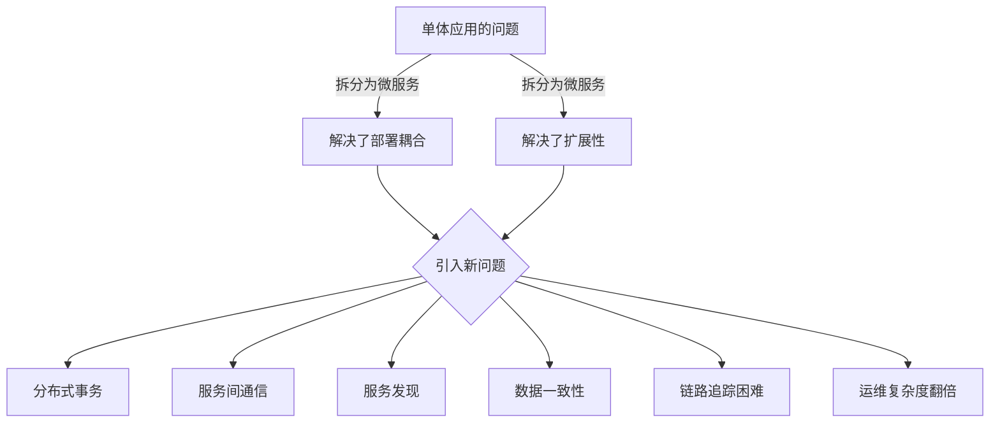
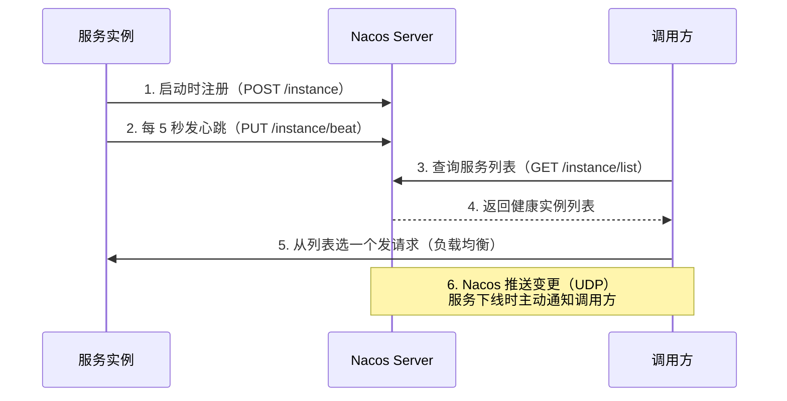
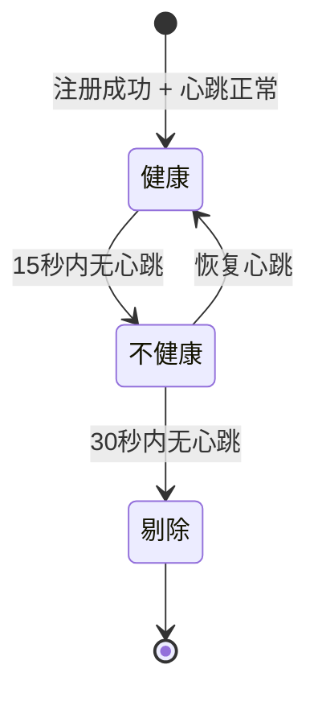
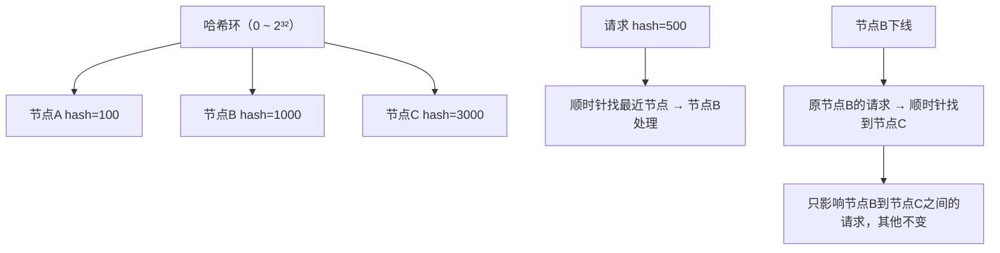
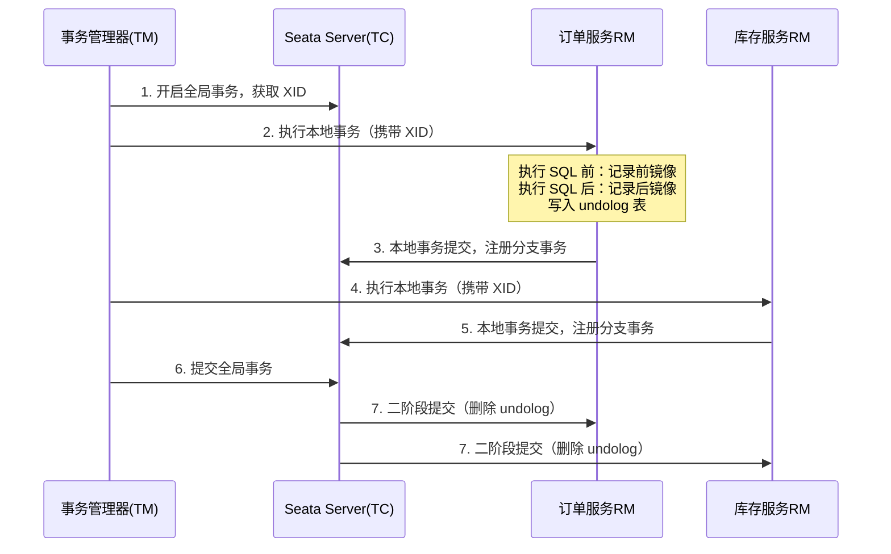
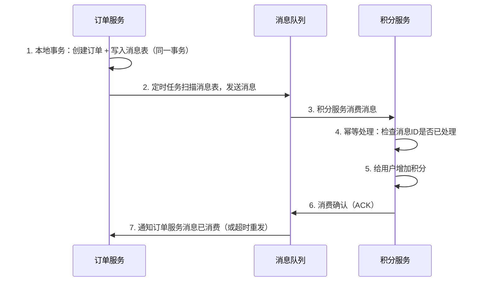
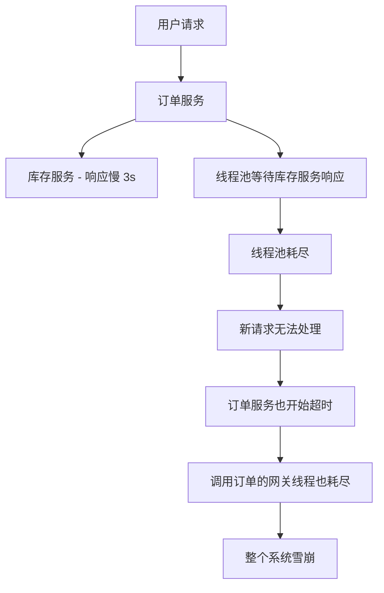
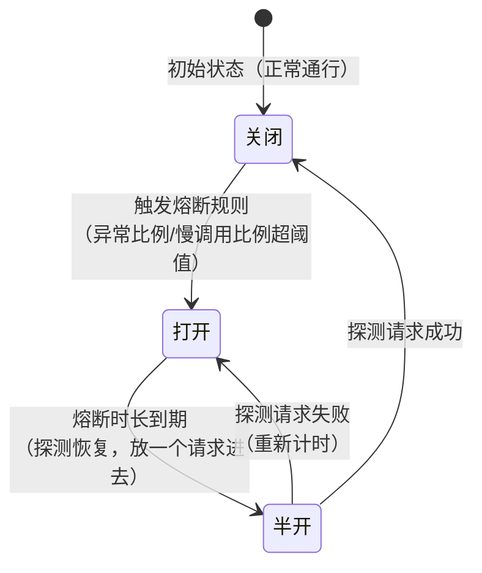
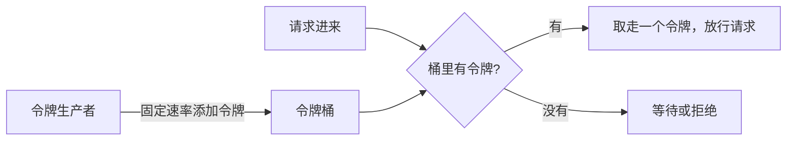
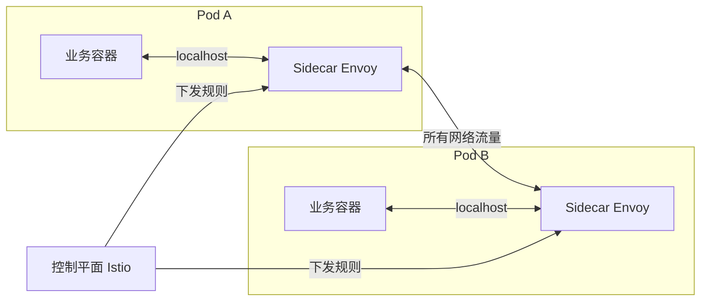

# 微服务架构 · 02 技术深度精讲

> 定位：理解"为什么这样设计"。读完不只会用，更能在面试和架构讨论中说出所以然。

---

## 第 1 章：微服务 vs 单体架构

### 1.1 单体架构的真实痛点

单体不是坏的架构，它在项目早期其实比微服务效率高得多——部署简单、调试方便、事务天然一致。单体出问题，是在规模上去之后：

**痛点一：部署耦合**
哪怕只改了一个按钮的文案，也要把整个应用重新打包部署。五个团队同时改代码，合并冲突解到崩溃。

**痛点二：扩展性差**
订单模块是瓶颈，但你只能把整个应用扩容，用户模块跟着多开了十台机器，浪费资源。

**痛点三：技术栈绑死**
单体里 Java 锁死了，想引入 Python 做机器学习模块？做不到。

**痛点四：故障隔离差**
一个内存泄露的模块，能把整个进程搞挂，其他功能全受影响。

---

### 1.2 微服务引入的代价

微服务不是银弹。把单体拆成微服务，你解决了上面的问题，但同时引入了新问题：

图：微服务架构复杂度来源



**分布式系统八大谬误（Peter Deutsch）——每一条都是真实的坑：**

1. 网络是可靠的（不是，会丢包、抖动）
2. 延迟为零（不是，跨服务调用比方法调用慢几个数量级）
3. 带宽无限（不是，序列化大对象会吃满带宽）
4. 网络是安全的（不是，内网也要考虑权限）
5. 拓扑不变（不是，节点会挂、会迁移）
6. 只有一个管理员（不是，多团队各管各的）
7. 传输代价为零（不是，序列化/反序列化有 CPU 开销）
8. 网络是同构的（不是，混合了各种协议和环境）

> **一句话总结**：微服务不是"更好的单体"，是用运维复杂度换来了业务灵活性。只有团队规模和业务复杂度达到一定程度，这笔账才划算。

### 1.3 拆分时机与粒度

**什么时候该拆：**
- 单个模块的迭代频率远高于其他模块，部署冲突频繁
- 某个功能的性能需求与其他模块差异巨大，需要单独扩容
- 团队超过 20 人，代码库协作摩擦越来越大
- 需要引入不同技术栈实现某个功能

**拆分粒度的判断（DDD 的 Bounded Context）：**

```
一个服务 = 一个业务领域的边界上下文

好的边界：用户服务（登录、注册、用户信息）
坏的边界：按技术层拆（把所有 Repository 放一个服务、所有 Service 放一个服务）

原则：高内聚（同一个业务域的代码在一起）、低耦合（不同服务间依赖尽量少）
```

---

## 第 2 章：服务注册与发现原理

### 2.1 为什么需要注册中心

没有注册中心时，微服务要调用另一个服务，得把 IP + 端口硬编码在配置里：

```yaml
# 硬编码的问题
user-service:
  url: http://192.168.1.100:8081
```

问题是：IP 会变（弹性伸缩、机器故障迁移），端口会变，服务实例数会变。硬编码维护成本极高，而且无法支持弹性伸缩。

注册中心解决的问题：**服务实例把自己的地址动态注册进去，调用方查注册中心拿地址，不需要提前知道 IP。**

### 2.2 Nacos 注册中心架构

图：Nacos 服务注册与发现流程



**Nacos 集群数据一致性：**

Nacos 支持两种模式：

| 模式 | 一致性协议 | CAP | 适用场景 |
|------|----------|-----|---------|
| AP 模式（默认） | Distro（最终一致性） | 可用性优先 | 临时实例（微服务注册） |
| CP 模式 | Raft（强一致性） | 一致性优先 | 持久实例（需要强一致配置） |

**Raft 协议简述（CP 模式下）：**
- 集群有一个 Leader，所有写操作都走 Leader
- Leader 把日志复制给超过半数的 Follower 才算提交
- Leader 挂了，Follower 发起选举，票多的当新 Leader
- 这就是为什么 Nacos 集群推荐奇数台（3台/5台），偶数台容错能力没有增加

### 2.3 临时实例 vs 持久实例

| 类型 | 心跳方式 | 下线行为 | 典型场景 |
|------|---------|---------|---------|
| 临时实例（ephemeral=true，默认） | 客户端主动发心跳 | 心跳超时自动剔除 | 微服务实例 |
| 持久实例（ephemeral=false） | 服务端主动探测 | 不会自动剔除，标记不健康 | 传统物理机服务 |

**状态机（临时实例）：**



> **一句话总结**：Nacos 的 AP 模式用最终一致性换高可用，适合微服务这种实例频繁上下线的场景；CP 模式强一致但牺牲了可用性，适合配置类数据。

---

## 第 3 章：负载均衡算法深度解析

### 3.1 常见算法对比

| 算法 | 原理 | 优点 | 缺点 | 适用场景 |
|------|------|------|------|---------|
| 轮询（Round Robin） | 请求依次分配给每个实例 | 简单均匀 | 不考虑实例性能差异 | 实例配置相同 |
| 加权轮询 | 按权重比例分配 | 可以区分高低配实例 | 需要手动维护权重 | 实例配置不同 |
| 随机 | 随机选一个实例 | 简单 | 可能随机不均匀 | 简单场景 |
| 最少连接 | 选当前连接数最少的实例 | 自适应负载 | 需要维护连接计数 | 连接时间差异大 |
| 一致性哈希 | 按请求特征（如 userId）哈希到固定实例 | 同一用户总去同一实例（缓存友好） | 实例变动时有请求迁移 | 有本地缓存的场景 |

### 3.2 一致性哈希详解

**问题背景：** 普通取模哈希 `hash(userId) % N`（N 是实例数），当增减一个实例时，N 变了，几乎所有请求都会路由到不同实例，本地缓存全部失效。

**一致性哈希的解法：**

图：一致性哈希环



**虚拟节点解决数据倾斜：**

真实情况下三个节点的哈希值可能集中在环的某段，导致节点分布不均匀。解法是给每个真实节点创建多个"虚拟节点"（如 150 个），均匀分布在环上，再映射回真实节点。

```java
// 虚拟节点实现示意
TreeMap<Integer, String> virtualNodes = new TreeMap<>();
for (String node : realNodes) {
    for (int i = 0; i < 150; i++) {  // 每个真实节点 150 个虚拟节点
        int hash = hash(node + "#" + i);
        virtualNodes.put(hash, node);
    }
}

// 路由：找 hash 值大于等于请求 hash 的第一个虚拟节点
String targetNode = virtualNodes.ceilingEntry(requestHash).getValue();
```

> **一句话总结**：一致性哈希让实例增减时只有"相邻"的请求受影响，不是全量重新分配；虚拟节点是防止数据倾斜的工程实践。

### 3.3 客户端 vs 服务端负载均衡

```mermaid
graph LR
    subgraph 客户端负载均衡（Ribbon/LoadBalancer）
    C1[调用方] --> |本地查服务列表| R[本地负载均衡策略]
    R --> S1[实例A]
    R --> S2[实例B]
    end

    subgraph 服务端负载均衡（Nginx/LVS）
    C2[调用方] --> N[Nginx]
    N --> S3[实例A]
    N --> S4[实例B]
    end
```

| 维度 | 客户端负载均衡 | 服务端负载均衡 |
|------|--------------|--------------|
| 位置 | 调用方本地 | 独立代理层 |
| 性能 | 少一跳，更快 | 多一次网络跳转 |
| 可见性 | 调用方知道所有实例 | 调用方只知道代理地址 |
| 维护 | 每个客户端都有策略逻辑 | 集中维护更简单 |
| 适用 | 微服务内部调用 | 外部流量入口 |

---

## 第 4 章：分布式事务

### 4.1 为什么单体的事务在微服务里不能用

单体里，数据库事务靠 ACID 保证：同一个数据库连接，要么全提交，要么全回滚。

微服务里，订单服务和库存服务各自有自己的数据库，不在一个连接上。传统的 JDBC 事务管不到另一个服务的数据库。

**两阶段提交（2PC）理论上可以，但实践中问题多：**
- 协调者（Coordinator）是单点故障风险
- 准备阶段锁住资源，其他事务等待，吞吐量极低
- 协调者崩溃后，参与者处于"不确定状态"，需要人工介入

### 4.2 Seata AT 模式原理

AT 模式是 Seata 最常用的模式，目标是：**对业务代码无侵入，自动完成分布式事务协调**。

**核心机制：undolog 回滚日志**

图：Seata AT 模式两阶段



**回滚时发生什么：**

```
1. TC 通知各 RM 回滚
2. RM 用 undolog 的"前镜像"还原数据（执行反向 SQL）
3. 删除 undolog 记录
```

**AT 模式的全局锁：**

为了防止"脏读"（事务 A 还没提交，事务 B 就读到了事务 A 修改的数据），Seata AT 在写操作时会注册"全局行锁"，只有全局事务提交后才释放。这会影响并发性能，高并发场景要评估。

### 4.3 Seata TCC 模式

TCC = Try / Confirm / Cancel，业务侵入性强，但性能比 AT 好，适合高并发场景。

```java
// Try 阶段：预留资源（不真正扣减）
@LocalTCC
public interface InventoryTccService {

    @TwoPhaseBusinessAction(name = "deductInventory", commitMethod = "confirm", rollbackMethod = "cancel")
    boolean tryDeduct(BusinessActionContext context,
                      @BusinessActionContextParameter(paramName = "productId") Long productId,
                      @BusinessActionContextParameter(paramName = "count") Integer count);

    // Confirm 阶段：真正扣减库存（必须幂等！）
    boolean confirm(BusinessActionContext context);

    // Cancel 阶段：释放预留的库存（必须幂等！）
    boolean cancel(BusinessActionContext context);
}
```

**TCC 的三大陷阱：**

1. **空回滚**：Try 阶段网络超时，TM 认为失败触发 Cancel，但 Try 实际上没执行。Cancel 要判断是否有 Try 记录，没有就直接返回成功（不能报错）。

2. **幂等性**：Confirm/Cancel 可能因网络问题被重复调用，必须保证重复调用结果一样（记录执行状态，已执行则直接返回成功）。

3. **悬挂**：Cancel 先于 Try 执行（网络乱序），Try 执行时发现已经 Cancel 了，不能执行（否则预留的资源永远不会释放）。

### 4.4 消息最终一致性

适合对实时性要求不高、允许最终一致的场景（如下单后积分到账）：



**关键保障：**
- 消息至少投递一次（MQ 不成功就重发）
- 消费方幂等处理（用消息 ID 去重，防止重复加积分）

> 📎 **延伸阅读**：Seata 的接入配置，详见《微服务-01-实战使用手册》第 4 章网关（Seata 通常与业务服务部署，不走网关）。

---

## 第 5 章：熔断降级底层机制

### 5.1 雪崩效应的形成过程

没有熔断时，一个慢服务怎么把整个系统搞垮的：



**根本原因**：同步调用 + 线程池有限 + 下游服务无限等待。

### 5.2 熔断器状态机

Sentinel 的熔断器是一个三态状态机：



**滑动时间窗口计数：**

Sentinel 统计异常比例用的是滑动窗口，不是固定时间窗口。

```
固定时间窗口的问题：在窗口边界会有流量突刺
  [0s-1s] 正常 [1s-2s] 新窗口开始，计数清零 → 之前积累的高错误率被重置

滑动时间窗口：始终看最近 N 秒的数据
  每个时间点都是在看"过去 N 秒"，不存在窗口切换的清零问题
```

Sentinel 使用数组实现滑动窗口，把时间窗口分成多个小格（bucket），每个 bucket 记录这个时间片内的调用次数和错误次数，滑动时丢掉最老的 bucket，加入新的。

### 5.3 Sentinel vs Hystrix 核心区别

| 维度 | Sentinel | Hystrix |
|------|---------|---------|
| 隔离方式 | 信号量（默认） | 线程池隔离（默认） |
| 资源开销 | 低（不创建新线程） | 高（每个资源一个线程池） |
| 限流能力 | 强（多种限流规则） | 弱（只有简单计数） |
| 熔断规则 | 慢调用/异常比例/异常数 | 只有异常比例 |
| Dashboard | 功能强大，规则可动态配置 | 功能较简单 |
| 维护状态 | 阿里巴巴持续维护 | Netflix 已停止维护 |

**线程池隔离 vs 信号量隔离：**

```
线程池隔离（Hystrix 默认）：
  - 每个依赖服务一个专属线程池
  - 优点：完全隔离，一个池满不影响另一个
  - 缺点：线程切换有 CPU 开销，线程数量有上限
  - 适合：调用外部第三方服务（容错性要求高）

信号量隔离（Sentinel 默认）：
  - 限制同时并发的请求数（不创建新线程）
  - 优点：开销小，适合高并发
  - 缺点：如果下游慢，占用的是调用方线程，无法完全隔离
  - 适合：内部微服务调用（延迟可控）
```

### 5.4 限流算法详解

**计数器（固定窗口）：最简单，但有边界问题**

```
窗口：1秒内最多 100 个请求
问题：0.9s 来了 100 个请求（合法），1.1s 来了 100 个请求（合法）
     但实际上 200ms 内来了 200 个请求，是设定阈值的 2 倍
```

**滑动窗口：解决边界问题**

始终统计"最近 1 秒"的请求数，不存在固定窗口的边界突刺问题。

**漏桶：平滑输出，匀速处理**

```
比喻：水以任意速度倒入漏桶，桶底均速漏出（如每秒 100 个）
特点：无论入速多快，处理速度恒定；超过桶容量的请求直接丢弃
缺点：不支持突发流量（即使系统有余量，也按恒定速率处理）
```

**令牌桶：支持突发，更灵活**

```
比喻：系统以固定速率往桶里放令牌，每个请求取一个令牌；桶满了就不放了
特点：允许突发（桶积累的令牌可以被短时间内集中消耗）
场景：Sentinel 的预热（Warm Up）模式就是令牌桶的变种
```



> **一句话总结**：令牌桶比漏桶更适合微服务场景，因为它支持突发流量；Sentinel 默认使用的就是令牌桶思想的变体。

---

## 第 6 章：服务网格（Service Mesh）概览

### 6.1 Service Mesh 解决什么问题

Spring Cloud 把服务治理逻辑（熔断、限流、链路追踪）写在业务代码里，业务代码和治理代码耦合：

```java
// Spring Cloud 方式：治理逻辑嵌入业务代码
@SentinelResource(blockHandler = "xxx", fallback = "yyy")
@FeignClient(name = "user-service")
public UserDTO getUser(Long id) { ... }
```

Service Mesh 的思路是：把治理逻辑从业务代码里完全剥离，下沉到基础设施层（Sidecar 代理）。



**业务代码完全不感知**：服务发现、负载均衡、熔断、限流、链路追踪全在 Envoy 里做，业务代码只管写业务逻辑。

### 6.2 Istio 核心架构

| 组件 | 职责 |
|------|------|
| Envoy（数据平面） | 每个 Pod 里的 Sidecar，拦截所有进出流量，执行治理规则 |
| Pilot | 服务发现，把规则下发给 Envoy |
| Citadel | 负责服务间的 mTLS 认证（双向 TLS） |
| Mixer（已废弃） | 遥测数据收集，已拆入 Envoy 和其他组件 |

### 6.3 与 Spring Cloud 的关系

两者不是替代关系，而是不同层次的治理：

| 维度 | Spring Cloud | Service Mesh（Istio） |
|------|-------------|----------------------|
| 语言 | 绑定 Java/JVM | 语言无关 |
| 侵入性 | 需要引入 SDK | 对业务代码零侵入 |
| 部署要求 | 普通服务器即可 | 依赖 Kubernetes |
| 学习曲线 | 相对平缓 | 较陡（K8s + Istio 概念多） |
| 适用场景 | 中小规模微服务，Java 团队 | 大规模、多语言混合微服务 |

**一句话总结**：Spring Cloud 是代码级别的服务治理，Istio 是基础设施级别的服务治理。大多数公司用 Spring Cloud 完全够，只有多语言、超大规模场景才值得引入 Istio 的复杂度。

---

## 附录：关键概念速查

| 概念 | 一句话解释 |
|------|----------|
| CAP 定理 | 分布式系统不能同时满足一致性(C)、可用性(A)、分区容错性(P)，只能三选二 |
| BASE 理论 | 基本可用(BA)、软状态(S)、最终一致性(E)，是对 CAP 中 AP 的工程实践 |
| 幂等性 | 同一操作执行多次，结果与执行一次相同（防重复消费、防重复支付的核心要求） |
| 服务降级 | 核心功能出问题时，非核心功能主动返回兜底数据，保障主流程可用 |
| 服务熔断 | 下游异常率高时，主动断开调用，避免故障扩散（类比电路断路器） |
| 服务限流 | 控制接口的最大并发/QPS，保护系统不被流量打垮 |
| 灰度发布 | 新版本只分发给部分用户，验证无误后再全量切换 |
| 蓝绿部署 | 同时维护两套环境（蓝=当前生产，绿=新版本），切换时流量一次性切过去 |

> 📎 **延伸阅读**：以上概念的面试高频题，详见《微服务-03-面试题精讲》第二类底层原理题。
