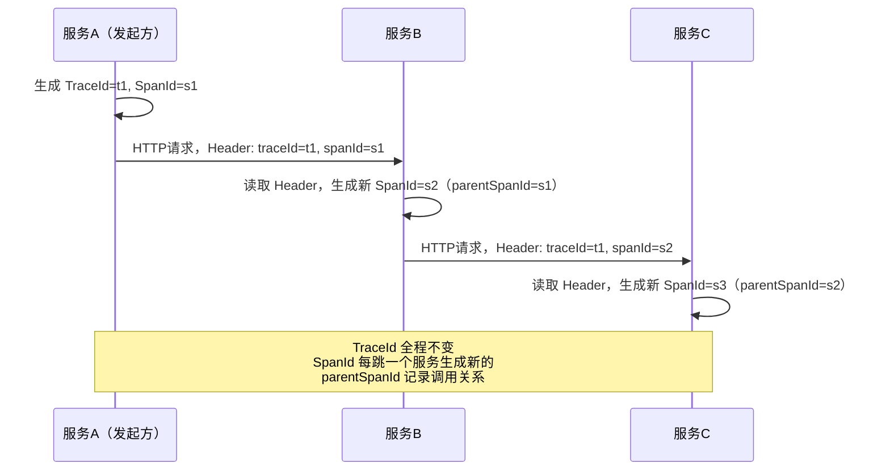
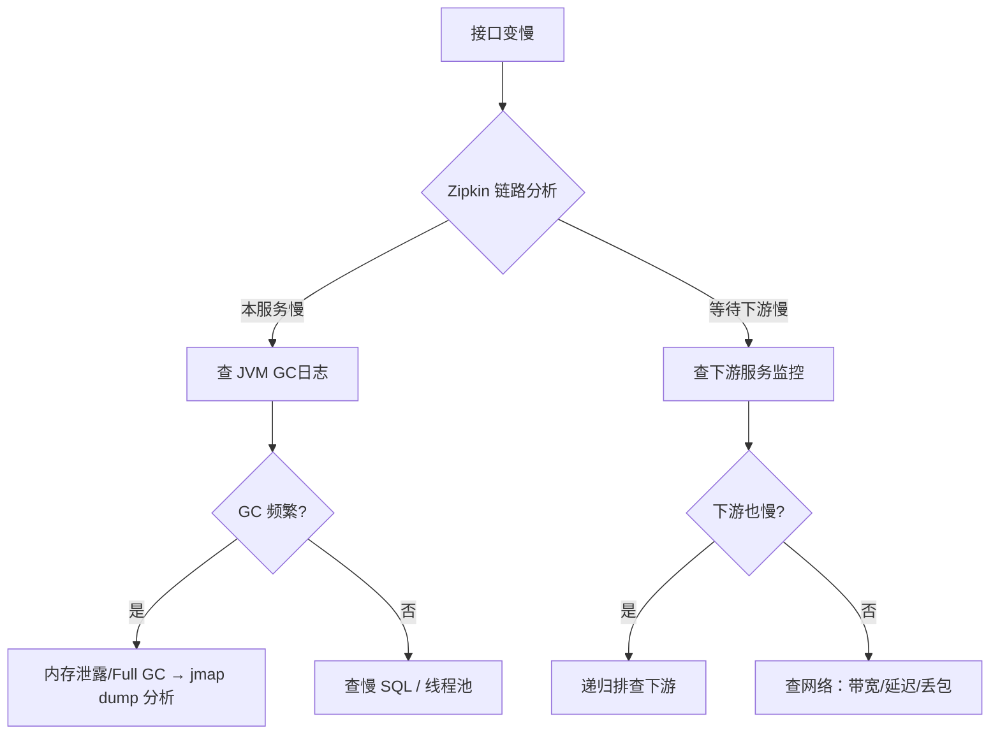

# 微服务架构 · 03 面试题精讲

> 定位：高频面试题三层回答手册。每道题都有「直答版」「深度解析」「加分项」三层，面试时按需展开。
> 题目难度：⭐ 基础 → ⭐⭐⭐⭐⭐ 顶级挑战

---

## 题型一览

| 题型 | 数量 | 特征 |
|------|------|------|
| 基础概念题 | 6 道 | ⭐~⭐⭐，考察定义和理解 |
| 底层原理题 | 7 道 | ⭐⭐⭐~⭐⭐⭐⭐，考察机制和为什么 |
| 对比分析题 | 5 道 | ⭐⭐⭐，考察横向比较和选型判断 |
| 场景设计题 | 5 道 | ⭐⭐⭐⭐~⭐⭐⭐⭐⭐，考察系统设计和权衡能力 |

---

## 第一类：基础概念题

---

### Q1 什么是微服务？它和单体架构的核心区别是什么？

**直答版：**
微服务是把一个大应用拆分成多个小服务的架构风格，每个服务独立部署、有自己的数据库、通过 API 通信。和单体架构的核心区别是：单体所有功能在一个进程里，微服务每个功能是独立进程。

**深度解析：**
- 单体的问题在规模大了之后才显现：部署耦合（改一个功能要全量发布）、扩展粗粒度（只能整体扩容）、团队协作摩擦大
- 微服务解决了这些，但引入了新的复杂度：分布式事务、服务发现、网络故障处理、运维复杂度翻倍
- 不是"微服务更好"，是"合适规模用合适架构"——团队小于 10 人时，单体往往比微服务效率高

**加分项：**
> 可以提到康威定律："系统结构反映组织结构"。微服务的服务拆分往往和团队边界对齐，每个团队负责一到两个服务，独立交付，这才是微服务真正的价值来源，不只是技术层面的拆分。

---

### Q2 服务注册中心的作用是什么？

**直答版：**
注册中心维护了当前所有健康服务实例的地址列表。服务启动时把自己的地址注册进去，调用方通过注册中心查询目标服务有哪些实例，再从中选一个发请求，不需要提前知道 IP。

**深度解析：**
- 没有注册中心时只能硬编码 IP，弹性伸缩、故障迁移后 IP 变了就全挂
- 注册中心还提供了健康检查：实例挂了会被自动从列表移除，调用方不会路由到死节点
- 注册中心本身要高可用，一般部署奇数台集群（3 台或 5 台）

**加分项：**
> 提到客户端缓存：调用方不是每次请求都去注册中心查，而是在本地缓存一份实例列表，注册中心通过推送（Nacos 用 UDP）通知变更。这样即使注册中心短暂不可用，调用方依然能用缓存的列表发请求——这就是 Nacos 选择 AP 模式的原因。

---

### Q3 API 网关的作用是什么？不用网关可以吗？

**直答版：**
API 网关是所有外部请求的统一入口，负责路由转发、统一鉴权、限流、跨域、日志等横切关注点。把这些逻辑放在网关统一处理，下游服务就不用重复实现。

**深度解析：**
- 不用网关，每个服务都要暴露自己的 IP + 端口给前端，前端要维护所有服务地址，改一个服务的地址前端也要改
- 每个服务都要自己实现鉴权逻辑，代码重复、容易漏
- 网关还能做协议转换（外部 HTTP 转内部 gRPC）、灰度路由（把 1% 的请求打到新版本）

**加分项：**
> 网关是单点入口，高可用很重要。实际部署会在网关前面再加一层 Nginx/LVS 做四层负载均衡，网关本身也要多实例部署。同时网关不要做业务逻辑，只做通用横切逻辑，否则会变成新的"单体"。

---

### Q4 什么是服务熔断？什么是服务降级？有什么区别？

**直答版：**
- **熔断**：下游服务异常率高时，主动切断调用链路，让请求快速失败，不再等待（像电路保险丝）
- **降级**：服务不可用时，返回一个兜底响应（如默认数据、提示语），保障核心流程可用
- 区别：熔断是触发条件，降级是处理结果。熔断了就会触发降级逻辑。

**深度解析：**
- 熔断的核心价值是防止雪崩：下游慢了，调用方的线程全卡在等待上，线程池耗尽后整个调用方也崩了，故障像雪崩一样扩散
- 降级也可以主动触发，不一定等熔断：比如大促期间提前把"推荐商品"模块降级（返回预设的热销商品），省出资源给核心下单链路

**加分项：**
> 降级的粒度也很重要——要区分哪些是核心链路（下单、支付，绝对不能降级）、哪些是非核心链路（评论、推荐，可以降级）。大促预案里会提前圈定降级开关，流量高峰时手动触发。

---

### Q5 什么是 CAP 定理？微服务里怎么用？

**直答版：**
分布式系统不能同时满足：
- **C**（一致性）：所有节点同时看到相同数据
- **A**（可用性）：每个请求都能得到响应（不管数据是否最新）
- **P**（分区容错性）：网络分区（节点间无法通信）时系统还能运行

因为网络分区是客观存在的，P 必须有，所以只能在 C 和 A 之间取舍：CP 或 AP。

**深度解析：**
- 注册中心选型：Zookeeper 选 CP（网络分区时拒绝服务，保证数据一致）；Eureka/Nacos（AP模式）选 AP（分区时可能读到旧数据，但不会拒绝服务）
- 微服务注册中心通常选 AP：服务列表稍有滞后没关系（最多路由到一个刚下线的实例，重试一次），但注册中心自己挂了比什么都严重
- 数据库选 CP：用户余额这种数据，宁可请求失败也不能让两个节点数据不一致

**加分项：**
> CAP 是理论模型，实践中还有 BASE 理论：基本可用（Basic Available）、软状态（Soft State）、最终一致性（Eventually Consistent）。大多数微服务追求的是 BASE，而不是强一致，比如下单扣库存、积分到账，允许有秒级的延迟，但最终一定一致。

---

### Q6 微服务拆分有什么原则？

**直答版：**
- **单一职责**：一个服务只做一件事，边界清晰
- **高内聚低耦合**：服务内部逻辑紧密相关，服务之间依赖尽量少
- **业务边界优先**（DDD Bounded Context）：按业务领域拆，不按技术层拆

**深度解析：**
- 拆太细的问题：一个业务操作跨几十个服务，分布式事务复杂度爆炸，性能也差（每次调用都是网络IO）
- 拆太粗的问题：还是存在部署耦合，没解决核心问题
- 经验规则：一个服务对应一个业务域（如用户、商品、订单、支付），服务代码一个团队维护得过来

**加分项：**
> 还有"演进式拆分"的实践：先做单体，随着业务增长逐步识别瓶颈点，把最需要独立扩展/独立部署的部分先拆出来，不要一开始就追求微服务最细粒度。Amazon 和 Netflix 早期都是先单体再微服务的。

---

## 第二类：底层原理题

---

### Q7 Nacos 注册中心的 AP 和 CP 模式有什么区别？分别适合什么场景？

**直答版：**
Nacos 支持 AP 和 CP 两种模式：
- **AP 模式**（默认）：用 Distro 协议，最终一致性，优先保证可用性。适合微服务实例注册
- **CP 模式**：用 Raft 协议，强一致性，网络分区时可能拒绝写入。适合需要强一致的配置数据

**深度解析：**
AP 模式下（临时实例）：
- 每个节点都可以接受注册请求
- 节点间通过 Distro 协议异步同步数据
- 网络分区时，各自接受注册，分区恢复后合并（可能有短暂不一致）

CP 模式下（持久实例）：
- 写操作必须经过 Raft Leader
- Leader 把日志复制给超过半数节点才提交
- 网络分区时，少数派节点拒绝写入（保证一致性）

切换命令：
```bash
curl -X PUT 'http://localhost:8848/nacos/v1/ns/operator/switches?entry=serverMode&value=CP'
```

**加分项：**
> Raft 选举：集群有且只有一个 Leader；Follower 长时间收不到 Leader 的心跳，发起选举，获得超过半数票的成为新 Leader。这是为什么 Nacos 集群要部署奇数台——3 台能容 1 台故障，5 台能容 2 台；4 台和 3 台容错能力一样，但多花了一台机器。

---

### Q8 Sentinel 的熔断器状态机是怎么工作的？

**直答版：**
三个状态：
- **关闭（Closed）**：正常状态，放行请求，统计异常指标
- **打开（Open）**：达到熔断阈值，直接拒绝请求（快速失败），不再调用下游
- **半开（Half-Open）**：熔断时长到期后，放一个探测请求进去，成功则关闭熔断，失败则重新打开

**深度解析：**

Sentinel 三种熔断策略：
1. **慢调用比例**：响应时间超过阈值的请求占比超过设定值，触发熔断
2. **异常比例**：异常请求数占比超过设定值，触发熔断
3. **异常数**：单位时间内异常数超过设定值，触发熔断

统计依赖**滑动时间窗口**（不是固定窗口）：把统计窗口切成多个 bucket，每个 bucket 统计该时间片内的调用次数和失败次数，当前时刻统计的是最近 N 秒的所有 bucket 的汇总。这避免了固定窗口在边界时的流量突刺问题。

**加分项：**
> 半开状态的设计很精妙——直接从打开跳回关闭太激进（下游可能还没恢复），但一直打开又无法自愈。半开用"探测一个请求"来验证下游是否恢复，是一种低成本的健康探测机制。追问：探测失败后为什么要重新计时（而不是立即再探测）？因为给下游更多恢复时间，避免探测请求本身加重负担。

---

### Q9 Seata AT 模式的原理是什么？undolog 是如何工作的？

**直答版：**
Seata AT 模式通过两阶段提交实现分布式事务，业务代码无需改动：
- **一阶段**：各服务执行本地事务，同时把"前镜像"和"后镜像"写入 undolog 表
- **二阶段（提交）**：全局事务成功，TC 通知各 RM 删除 undolog（异步，快）
- **二阶段（回滚）**：全局事务失败，TC 通知各 RM 用 undolog 的前镜像还原数据

**深度解析：**

undolog 记录的内容：

```sql
-- 执行 UPDATE t_stock SET count = count - 1 WHERE product_id = 1 之前
-- 前镜像（before image）：count = 10
-- 后镜像（after image）：count = 9

-- 回滚时执行：UPDATE t_stock SET count = 10 WHERE product_id = 1
```

**全局锁的作用（防脏读）：**
事务 A 修改了某行数据（一阶段已提交），但全局事务还未提交，此时如果事务 B 也要修改这行，会检查是否有全局锁，有锁就等待。这防止了"全局事务 A 回滚时，事务 B 看到了 A 的中间状态"。

❌ 常见误区：AT 模式的本地事务是真实提交的（不是悬挂），回滚靠 undolog 执行反向 SQL，不是数据库级别的回滚。

**加分项：**
> AT 模式的性能瓶颈是全局锁。写热点数据（如库存扣减）时，全局锁竞争严重，吞吐量会大幅下降。高并发场景建议用 TCC 模式（预留资源，业务自己控制）或消息最终一致性（允许短暂不一致）。

---

### Q10 一致性哈希的虚拟节点解决了什么问题？

**直答版：**
普通一致性哈希中，少量节点在哈希环上分布可能不均匀，导致某个节点承担了大部分请求（数据倾斜）。虚拟节点给每个真实节点创建多个（如 150 个）均匀分布的虚拟节点，使得每个真实节点平均承担接近 1/N 的流量。

**深度解析：**

没有虚拟节点时的问题：

```
哈希环: 0 -------- A(100) ---- B(200) ------------------------- C(3000) ---- 4294967295
                                       ↑
                              B和C之间有大量哈希值落在这里
                              这些请求全给 C 处理，C 压力很大
```

有虚拟节点时：每个真实节点有 150 个虚拟点散落在环上，流量分配更均匀。

**加分项（追问）：虚拟节点越多越好吗？**
> 不是。虚拟节点越多，哈希环的数据结构（通常是 TreeMap）越大，内存占用越多，查找时间也更长（虽然是 O(log N)）。实践中 100-200 个虚拟节点是常用范围，能在均匀性和性能之间取得平衡。

---

### Q11 微服务的链路追踪是怎么实现跨服务传递 TraceId 的？

**直答版：**
通过 HTTP Header 传递。发起请求时，把 TraceId 和 SpanId 写入请求头（如 `X-B3-TraceId`），下游服务收到请求时从 Header 里读出来，放入自己的日志上下文（MDC），并作为父 SpanId 继续传递给更下游的服务。

**深度解析：**



Zipkin 根据这些信息重建调用树，展示每个 Span 的耗时和调用层级。

**加分项：**
> 采样率的权衡：记录所有请求的链路数据会消耗大量存储和性能（序列化、网络传输到 Zipkin）。生产环境通常设 1%-10% 采样率，只记录抽样到的请求。问题是：出现 bug 时，那次请求可能没被采样，看不到链路。解决方案：异常请求强制采样（无论采样率如何，出错的请求都记录）。

---

### Q12 TCC 模式的空回滚、幂等性、悬挂问题分别是什么？怎么解决？

**直答版：**
- **空回滚**：Try 没执行，Cancel 先到了，Cancel 要能正常返回（不能报错）
- **幂等性**：Confirm/Cancel 可能被重复调用，结果必须一样
- **悬挂**：Cancel 比 Try 先执行，Try 随后执行时预留的资源永远无法释放

**深度解析：**

**统一解法：在事务日志表里记录 Try/Confirm/Cancel 的执行状态。**

```java
// 事务日志表
CREATE TABLE tcc_transaction_log (
    xid VARCHAR(128) PRIMARY KEY,    -- 全局事务 ID
    branch_id BIGINT,                -- 分支事务 ID
    status TINYINT,                  -- 0:初始 1:Try成功 2:Confirm 3:Cancel
    create_time DATETIME
);

// Try 方法：插入 status=1 的记录
void tryDeduct(context, ...) {
    // 检查是否有 Cancel 记录（防悬挂）
    if (logExists(xid, STATUS_CANCEL)) return;  // 已Cancel，不执行Try
    // 正常执行，插入 Try 记录
    insertLog(xid, STATUS_TRY);
    // 预留库存...
}

// Cancel 方法
void cancel(context) {
    // 检查 Try 记录是否存在（处理空回滚）
    if (!logExists(xid, STATUS_TRY)) {
        insertLog(xid, STATUS_CANCEL);  // 记录Cancel，防止后续Try再执行
        return;  // 空回滚，直接返回
    }
    // 检查幂等（是否已经Cancel过）
    if (logExists(xid, STATUS_CANCEL)) return;
    // 执行真正的Cancel逻辑
    insertLog(xid, STATUS_CANCEL);
    // 释放预留库存...
}
```

**加分项：**
> 这套事务日志方案可以统一解决三个问题，但带来了额外的数据库写操作。高并发时这个日志表本身可能成为瓶颈，可以用 Redis 替代数据库存储事务状态（注意 Redis 挂了的兜底方案）。

---

### Q13 OpenFeign 的负载均衡是怎么实现的？

**直答版：**
OpenFeign 底层集成了 Spring Cloud LoadBalancer（取代了已废弃的 Ribbon）。每次发请求前，LoadBalancer 从注册中心（Nacos）的本地缓存里拿到服务实例列表，按策略（默认轮询）选一个实例，把服务名替换成具体的 IP:Port，再发 HTTP 请求。

**深度解析：**

```
Feign 调用流程：
  @FeignClient(name="user-service")
  ↓ 代理
  LoadBalancerClient.choose("user-service") → 从本地缓存取实例列表
  ↓ 选实例（轮询）
  实例: 192.168.1.100:8081
  ↓ 替换 URL
  http://user-service/user/1 → http://192.168.1.100:8081/user/1
  ↓ 发 HTTP 请求
```

本地缓存的刷新：
- Nacos 主动推送（UDP）：实例上下线时 Nacos 推通知给客户端
- 客户端定时拉取（兜底）：每 30 秒主动拉一次，防止推送消息丢失

**加分项：**
> 切换负载均衡策略：Spring Cloud LoadBalancer 默认轮询，可以注入自定义的 `ReactorServiceInstanceLoadBalancer` 实现一致性哈希或随机策略。但 Spring Cloud LoadBalancer 的策略比 Ribbon 少，Nacos 提供了 `NacosLoadBalancer` 支持权重（在 Nacos 控制台给实例设置权重，高配机器权重高）。

---

## 第三类：对比分析题

---

### Q14 Nacos、Eureka、Zookeeper 作为注册中心有什么区别？

**直答版：**

| 维度 | Nacos | Eureka | Zookeeper |
|------|-------|--------|-----------|
| CAP | AP/CP 可切换 | AP | CP |
| 一致性协议 | Distro/Raft | 最终一致 | ZAB |
| 健康检查 | 客户端心跳 + 服务端探测 | 客户端心跳 | Session 机制 |
| 配置中心 | 内置 | 无 | 可用（但不是专为此设计）|
| 维护状态 | 阿里巴巴持续更新 | Netflix 停止维护 | Apache 持续维护 |

**深度解析：**
- **Zookeeper**：CP，为分布式协调设计，不是专门做服务注册的；网络分区时 Leader 选举期间不可用（可能长达秒级）；对微服务来说这段时间服务调用会失败
- **Eureka**：AP，专为服务注册设计；有自我保护机制（短时间内大量心跳丢失时，不剔除实例，认为是网络问题而非实例挂了）；已停止维护，不建议新项目用
- **Nacos**：兼顾两者，且自带配置中心，一个组件搞定两件事；国内用 Spring Cloud Alibaba 栈首选

**加分项：**
> Eureka 的自我保护机制有点争议：本意是防止网络抖动时误剔除健康实例，但如果实例真的挂了，自我保护期间调用方还是会路由到挂掉的实例（结合重试/熔断才能处理）。Nacos 的临时实例没有自我保护，超时就剔，更干脆。

---

### Q15 分布式事务的几种方案怎么选？

**直答版：**

| 方案 | 一致性 | 性能 | 业务侵入 | 适用场景 |
|------|--------|------|---------|---------|
| Seata AT | 强一致 | 中 | 低（无需改代码） | 内部服务间，并发中等 |
| Seata TCC | 强一致 | 高 | 高（要写3个方法）| 高并发，性能敏感 |
| Saga | 最终一致 | 高 | 高（需补偿逻辑） | 长事务，跨系统 |
| 消息最终一致性 | 最终一致 | 高 | 中（消息表+消费幂等）| 允许短暂不一致 |

**深度解析：**
- **AT 最省事**：加个 `@GlobalTransactional` 注解就行，适合并发不高的内部事务
- **TCC 最灵活**：写 try/confirm/cancel 三个方法，自己控制预留和提交，高并发场景更好
- **消息最终一致性最适合异步场景**：下单成功后发消息给积分服务，积分服务最终一定会加，但不是立即加，适合"不需要实时强一致"的场景（如积分、通知）
- **Saga 适合长流程**：跨多个外部系统（如保险承保流程，涉及十几个步骤），每个步骤有对应的补偿操作

**加分项：**
> 优先考虑"能不能避免分布式事务"：通过合理的业务设计减少跨服务事务。比如把强一致的操作放在同一个服务内，用异步消息处理可以最终一致的操作。分布式事务是最后手段，能不用就不用。

---

### Q16 Sentinel 和 Hystrix 的区别？

**直答版：**
Sentinel 是阿里开源的流量治理框架，Hystrix 是 Netflix 开源的熔断框架（已停止维护）。

核心区别：
- Hystrix 默认线程池隔离（创建独立线程池，有 CPU 开销），Sentinel 用信号量隔离（开销小）
- Sentinel 限流规则更丰富（QPS、并发线程数、热点参数），Hystrix 只有简单限流
- Sentinel 有实时 Dashboard，规则可热更新；Hystrix Dashboard 功能弱
- Hystrix 已停止维护，新项目不建议用

**加分项：**
> 线程池隔离的实际价值：下游响应慢时，Hystrix 的线程池耗尽后，调用方自己的业务线程不受影响（因为等待是在独立线程池里）。Sentinel 的信号量隔离，一旦并发数满了，调用方的业务线程也会阻塞等待。在调用外部第三方接口（响应时间不可控）时，线程池隔离的安全性更高。

---

### Q17 OpenFeign、RestTemplate、gRPC 怎么选？

**直答版：**

| 方案 | 协议 | 性能 | 可读性 | 适用场景 |
|------|------|------|--------|---------|
| OpenFeign | HTTP/JSON | 中 | 高（声明式） | Spring Cloud 内部服务调用 |
| RestTemplate | HTTP/JSON | 中 | 低（命令式） | 简单调用，遗留代码 |
| gRPC | HTTP/2 + Protobuf | 高 | 中（需定义 proto）| 高性能、跨语言场景 |

**深度解析：**
- **OpenFeign**：Spring Cloud 生态首选，声明式接口好看好维护，整合 Nacos/Sentinel/Sleuth 开箱即用
- **RestTemplate**：Spring 3.x 时代的产物，Spring 6 已废弃，不建议新代码用；`WebClient` 是 WebFlux 下的替代方案
- **gRPC**：二进制协议 + IDL（接口定义语言），性能比 HTTP/JSON 高 2-5 倍；但需要额外定义 .proto 文件，调试不如 HTTP 方便；适合内部高频调用（如游戏服务器、实时系统）

**加分项：**
> 混合使用场景：对外（前端或第三方）用 HTTP/JSON（兼容性最好），内部高性能模块之间用 gRPC，Java 服务间日常调用用 OpenFeign。不需要非此即彼。

---

### Q18 客户端负载均衡和服务端负载均衡有什么区别？各有什么缺点？

**直答版：**
- **客户端负载均衡**（Ribbon/LoadBalancer）：调用方本地维护实例列表，自己选实例。少一次网络跳转，性能好；但每个客户端都要有负载均衡逻辑
- **服务端负载均衡**（Nginx/LVS）：请求先到代理，代理再转发给实例。集中管理策略，但多一跳，代理本身是单点（需高可用部署）

**加分项：**
> 微服务内部调用用客户端负载均衡（性能好，不多一跳）；外部流量入口用服务端负载均衡（Nginx）——前者调用方知道所有实例地址，适合注册中心管理的场景；后者不暴露内部实例，外部只知道 Nginx 地址，安全性更好。两者不是对立的，往往同时使用。

---

## 第四类：场景设计题

---

### Q19 如何防止微服务雪崩？有哪些手段？

**直答版：**
雪崩是下游慢导致上游线程耗尽进而全链路崩溃。防雪崩的手段：
1. **超时**：不要无限等待，设合理超时时间，快速失败
2. **熔断**：异常率高时主动断开，不再调用下游
3. **限流**：控制接口并发/QPS，不让流量把系统打垮
4. **降级**：核心链路出问题时，非核心功能返回兜底数据
5. **隔离**：不同接口/服务用不同的线程池，一个池耗尽不影响另一个

**深度解析：**

这五层防护需要组合使用：

```
用户请求 → 限流（QPS 100）→ 正常进入
             ↓（超限）
             快速失败（限流降级）

进入服务 → 超时 3 秒（不无限等待）→ 请求完成
             ↓（超时）
             熔断判断：慢调用比例 > 60%?
             ↓（是）
             熔断器打开 → 后续请求直接降级（不调下游）
```

**加分项（追问）：超时时间怎么设置？**
> 参考下游接口的 P99 响应时间（99% 的请求在多少毫秒内返回），在此基础上加一定余量（1.5倍）。设太短会频繁超时，设太长起不到保护作用。最好从压测数据来，而不是拍脑袋。

---

### Q20 下单时调用库存、支付、物流三个服务，如何保证事务一致性？

**直答版：**
根据一致性要求和并发量选方案：
- **中低并发**：Seata AT 模式，`@GlobalTransactional` 注解包住整个下单流程
- **高并发**：下单只做核心操作（扣库存+创建订单在同一服务保证本地事务），支付和物流用消息最终一致性

**深度解析：**

方案一（Seata AT，适合并发不高的B端系统）：

```java
@GlobalTransactional
public void createOrder(OrderRequest req) {
    // 1. 创建订单（本地数据库）
    orderMapper.insert(order);
    // 2. 扣减库存（调用库存服务，Seata 管理分布式事务）
    inventoryFeignClient.deduct(req.getProductId(), req.getCount());
    // 3. 创建支付单（调用支付服务）
    paymentFeignClient.createPayment(order.getId(), order.getAmount());
    // 任何一步失败，Seata 自动回滚所有操作
}
```

方案二（消息最终一致性，适合高并发C端）：

```
下单核心：
1. 本地事务：创建订单 + 扣库存（在同一个服务，同一个数据库，用本地事务）
              + 写消息表（记录"需要触发支付/物流"的事件）

异步处理：
2. 定时任务扫描消息表 → 发 MQ 消息
3. 支付服务消费消息 → 创建支付单（幂等）
4. 物流服务消费消息 → 创建运单（幂等）
```

**加分项：**
> 实际上"扣库存"在高并发电商里通常更早发生（加购时预占，下单时确认），真正下单时库存已经预占，不需要分布式事务扣库存。支付是异步的（用户支付后回调），物流是异步的（支付成功后触发）。拆开看，每个环节的事务其实都是本地的，用消息串联就够了。

---

### Q21 微服务如何实现灰度发布？

**直答版：**
灰度发布是让新版本只服务一部分用户，验证没问题后再全量切换。实现方式：
1. **网关层路由**：根据 Header/用户ID/Cookie 把特定请求路由到新版本实例
2. **注册中心 + 元数据**：给新版本实例打标签（`version=gray`），客户端负载均衡按标签选实例

**深度解析：**

方案：网关 + Nacos 元数据实现灰度

```yaml
# 新版本实例在 Nacos 注册时带上元数据
spring:
  cloud:
    nacos:
      discovery:
        metadata:
          version: gray    # 灰度版本标识
```

```java
// 自定义负载均衡策略：Header 里有 X-Gray: true 的请求，选 gray 实例
@Component
public class GrayLoadBalancer implements ReactorServiceInstanceLoadBalancer {
    @Override
    public Mono<Response<ServiceInstance>> choose(Request request) {
        HttpHeaders headers = ((RequestDataContext) request.getContext())
            .getClientRequest().getHeaders();
        boolean isGray = "true".equals(headers.getFirst("X-Gray"));

        List<ServiceInstance> instances = /* 从注册中心拿实例列表 */;
        List<ServiceInstance> filtered = instances.stream()
            .filter(i -> isGray
                ? "gray".equals(i.getMetadata().get("version"))  // 灰度请求选 gray 实例
                : !"gray".equals(i.getMetadata().get("version"))) // 普通请求不选 gray 实例
            .collect(Collectors.toList());
        // 从 filtered 里随机选一个
    }
}
```

在网关里，根据用户 ID 的尾号（或 A/B 测试分组）决定是否加 `X-Gray: true` Header。

**加分项：**
> 灰度发布的关键不只是流量路由，还有：
> 1. **数据库兼容性**：新版本若改了表结构，要保证新旧版本都能正常运行（先加字段不删，再全量发布后删）
> 2. **监控告警**：灰度期间密切关注错误率、响应时间，异常立即回滚
> 3. **回滚策略**：灰度实例单独部署，出问题直接下线灰度实例，流量回到稳定版本

---

### Q22 微服务之间出现了循环依赖怎么解决？

**直答版：**
循环依赖（A 调 B，B 调 A）是设计问题，正确做法是重新审视服务边界：
1. **抽公共服务**：把 A 和 B 都依赖的公共逻辑抽成第三个服务 C，A 和 B 都调 C
2. **事件驱动解耦**：A 完成后发消息，B 监听消息处理，不直接调用 A
3. **合并服务**：如果 A 和 B 强耦合，可能拆分粒度太细，考虑合并

**深度解析：**

❌ 错误案例：用户服务调订单服务（获取用户订单数），订单服务调用户服务（获取用户信息）

```
UserService → OrderService.getUserOrders(userId)
OrderService → UserService.getUserInfo(userId)    ← 循环依赖
```

✅ 正确做法：

```
选项 1：订单服务不调用户服务
  订单表里冗余存用户信息（创建时存入，不实时查）

选项 2：引入事件
  UserService 发"用户查询"事件 → OrderService 订阅并返回数据
  （避免直接 RPC 调用）

选项 3：抽出独立查询服务
  QueryService 聚合用户和订单数据，两者都调 QueryService
```

**加分项：**
> 循环依赖往往是服务边界划分不合理的信号。DDD 的"防腐层"模式可以帮助识别边界：每个服务应该是一个独立的业务能力单元，如果两个服务强耦合，要么合并，要么引入中间层（防腐层）做转换和隔离。

---

### Q23 线上微服务接口突然变慢，如何排查？

**直答版：**
分层排查：**外部 → 网络 → 本服务 → 下游依赖**

1. 看监控：接口 P99 响应时间、错误率、请求量有无异常
2. 看链路追踪（Zipkin）：慢在哪一段（本服务计算慢？还是调下游等待时间长？）
3. 看 JVM：GC 频率/停顿时间（GC 过多会导致服务抖动）
4. 看数据库：是否有慢 SQL，锁等待，连接池是否耗尽
5. 看下游服务：被调用的服务本身是否也变慢了

**深度解析：**



**常见原因清单：**

| 现象 | 可能原因 |
|------|---------|
| 只有某个接口慢 | 该接口的 SQL 没走索引，或有 N+1 查询 |
| 全部接口都慢 | Full GC、数据库连接池耗尽、下游全部慢 |
| 偶尔慢（抖动） | GC Pause、网络抖动、Redis 慢查询 |
| 早上 9 点准时慢 | 定时任务打数据库，或流量洪峰，或缓存在预热 |

**加分项（面试官追问）：排查工具有哪些？**
> - `jstack`：导出线程快照，看是否有大量线程阻塞（BLOCKED/WAITING）
> - `jmap -histo`：查内存对象分布，定位内存泄露
> - `arthas`：线上诊断神器，`trace` 命令可以追踪方法调用耗时，`watch` 可以观察方法入参和返回值，无需重启服务

---

## 高频易错对比速查

❌ **错误**：Nacos 命名空间填的是名称（如 "dev"）
✅ **正确**：Nacos 命名空间填的是 UUID 格式的命名空间 ID

---

❌ **错误**：Sentinel 的 blockHandler 处理所有异常
✅ **正确**：blockHandler 只处理 BlockException（流控/熔断触发），业务异常走 fallback

---

❌ **错误**：Seata AT 模式一阶段不提交本地事务（等全局提交才提交）
✅ **正确**：AT 模式一阶段直接提交本地事务（同时写 undolog），全局失败时靠 undolog 逆向回滚

---

❌ **错误**：TCC 的 Cancel 找不到 Try 记录就报错
✅ **正确**：Cancel 找不到 Try 记录是正常情况（空回滚），应记录 Cancel 状态并返回成功

---

❌ **错误**：Spring Cloud Gateway 模块可以引入 spring-boot-starter-web
✅ **正确**：Gateway 基于 WebFlux，与 spring-boot-starter-web 不兼容，引入会报错

---

> 📎 **延伸阅读**：各题涉及的底层原理，详见《微服务-02-技术深度精讲》对应章节；接入配置，详见《微服务-01-实战使用手册》。
